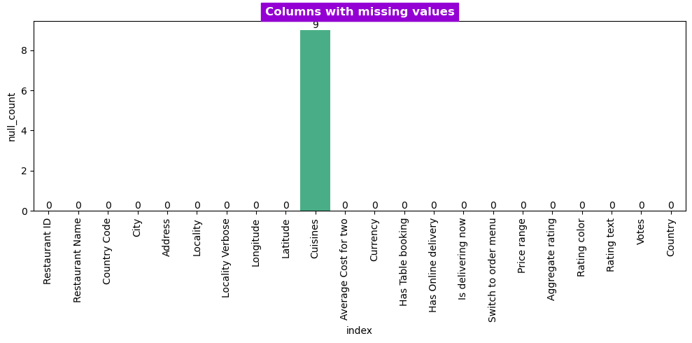
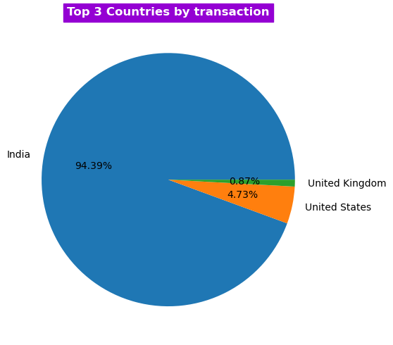
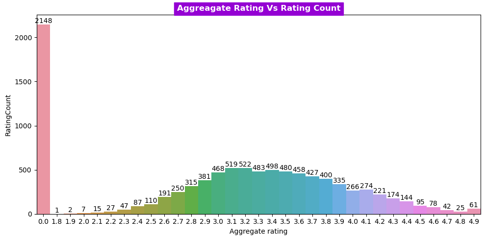
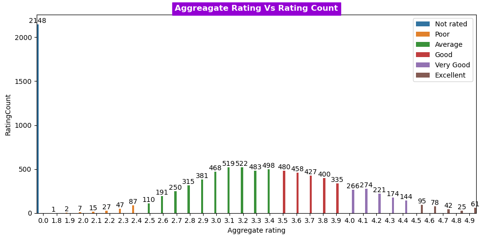
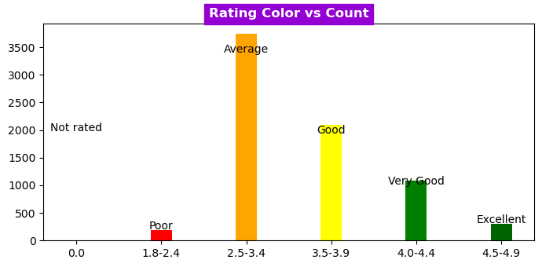
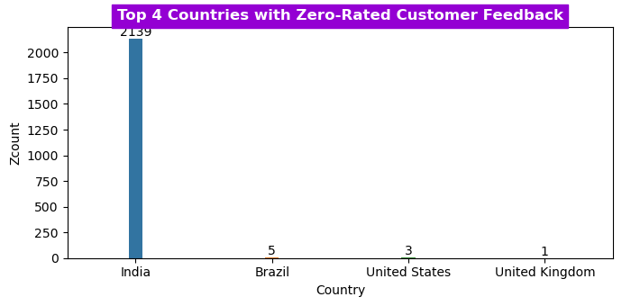
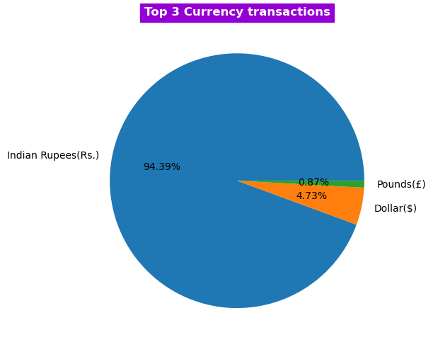
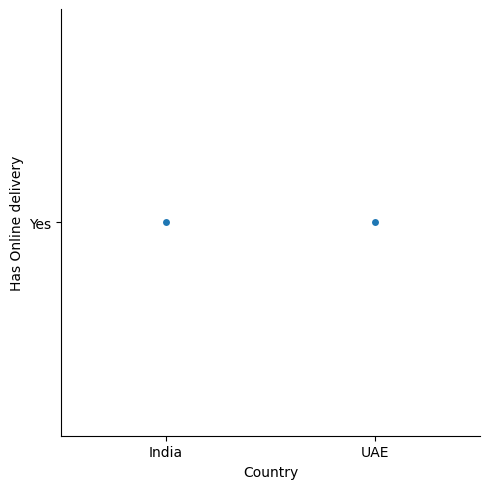
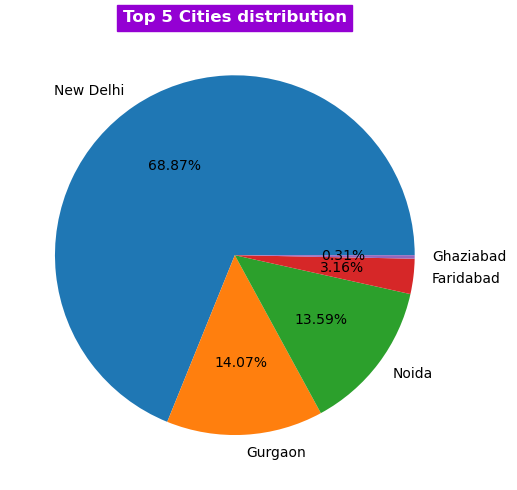
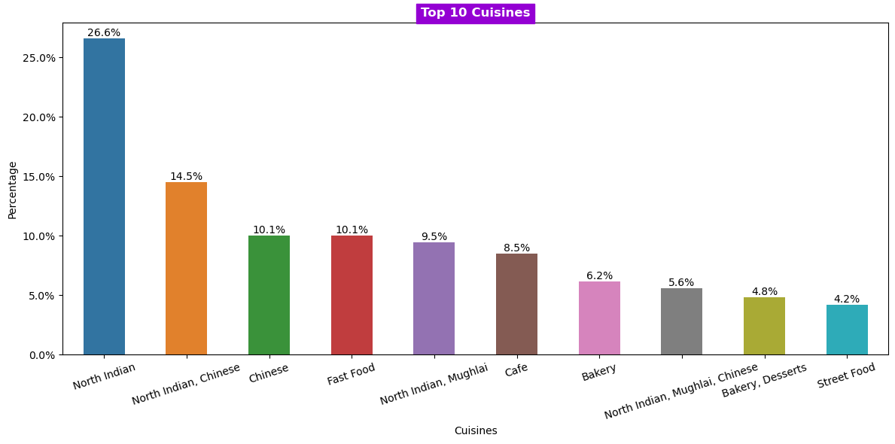

# 1. Project Name

  Analysis of Zomato Restaurant aggregator and food delivery data.

# 2. Description

 This project aims to analyze a dataset from Zomato, a prominent restaurant aggregator and food delivery company, using Python. The primary focus is on extracting insights related to ratings, countries, cities, currencies, and cuisines. To enhance the analysis, Excel and CSV files were merged to obtain country names.

# 3. Requirement

Zomato Dataset Analysis - **Personal Project Requirements**

**Overview:** This document outlines the requirements
for a personal project involving the analysis of the Zomato dataset. The aim of
this project is to demonstrate data analysis and visualization skills, as well
as to create a portfolio piece for showcasing on Github.

The following questions will be answered through the analysis:

1. Identify the columns that contain missing values within the dataset.

2. Visualize the top 3 countries with the highest number of transactions using a graph.

3. Determine the relationship between ratings and their corresponding text descriptions.

4. Generate a graph to compare Aggregate rating versus RatingCount.

5. Plot a graph for Aggregate rating vs RatingCount, incorporating color coding for better visualization.

6. Establish the maximum range of ratings present in the dataset.

7. Visualize the relationship between Rating color and their respective counts.

8. Detect the top 4 countries that have provided zero ratings.

9. Identify the country whose currency appears most frequently in the transactions.

10. List the countries that maintain an online presence.

11. Plot a graph showcasing the distribution of the top 5 cities.

12. Compile a list of the top 10 most prominent cuisines in the dataset.

**Data Requirements**

- Access to the Zomato dataset.

**Analysis Requirements**

- The analysis should include all the necessary steps to answer the 12 questions listed above.

- Data visualization should be used to represent the findings, such as plotting graphs and charts.

**Deliverables**

- A Jupyter Notebook or equivalent, detailing the data analysis process, including code and visualizations.

- A GitHub repository containing the project files, including the notebook, and any additional files required for the project.

**Timeline**

- The project should be completed within 4 weeks of the project start date – 20-June-2024

**Resources**

- Allocate at least 5 hours per week for working on the project.

# 4. Installation

Select a code editor of your choice that supports Python. In this project, we used "Jupyter" notebook, which can be downloaded and installed as part of the Anaconda distribution. Follow the steps provided in the link for assistance: [How to Install Anaconda Distribution on Your Computer &#8211; Dataquest](https://www.dataquest.io/blog/how-to-install-the-anaconda-distribution-on-your-computer/)

# 5. Pre-requisites

You need to have the following packages installed for this project: pandas, numpy, matplotlib, seaborn, and warnings. Use the following commands to install them:

Code:

```bash
pip install pandas
pip install numpy
pip install matplotlib
pip install seaborn
pip install warning
pip install typing
pip install IPython
```

# 6. Analysis Findings

**Introduction**

This project aims to analyze a restaurant dataset using
Python, with a focus on ratings, countries, cities, currencies, and cuisines. To
enhance the analysis, Excel and CSV files were merged to obtain country names.

**Results**

1.**Merging Excel and CSV for Country Names**: We successfully merged Excel and CSV files to obtain country names in the dataset.

2.**Missing Values**: The column with missing values was "Cuisines"
with 9 rows of data missing.



3.**Top 3 Countries by Transactions**: The top 3 countries with transactions were India
(94.39%), the USA (4.73%), and the UK (0.87%). This was represented in a bar
graph.



4.**Rating and Corresponding Text**: There were six rating ranges with corresponding text: 

1. 0.0 - 0.0  -> Not rated, 

2. 1.8 - 2.4  -> Poor,

3. 2.5 - 3.4  -> Average, 

4. 3.5 - 3.9  -> Good,  

5. 4.0 - 4.4  -> Very good, and 

6. 4.5 - 4.9  -> Excellent.

5.**Aggregate Rating Vs Rating Count**: A graph was plotted to represent the relationship between aggregate rating and rating count.



6.**Aggregate Rating Vs Rating Count with Hue
Colors**: The same graph from question 4 was
plotted with hue colors added to enhance visual representation.



7.**Rating Ranges**: The maximum number of rating ranges was found to be
2.4 to 3.5.

8.**Rating Color Vs Count**: A graph was plotted to represent the relationship
between rating color and count, revealing that "Orange" (Average) had
the highest count compared to the other rating colors.



9.**Top 4 Countries with Zero Rating**: The top 4 countries with a zero rating were India,
Brazil, the USA, and the UK.



10.**Currency Frequency**: The highest frequency currencies in
transactions were INR (India, 94.39%), USD (USA, 4.73%), and GBP (UK, 0.87%).



11.**Countries with Online Presence**: India and the UAE were found to have an online presence in the dataset.



12.**Top 5 Cities Distribution**: The top 5 cities were New Delhi (68.87%), Gurgaon
(14.07%), Noida (13.59%), Faridabad (3.26%), and Ghaziabad (0.31%), which were
represented in a graph.



13.**Top 10 Cuisines**: The top 10 cuisines were: North Indian, North Indian
& Chinese, Chinese, Fast Food, North Indian & Mughlai, Cafe, Bakery,
North Indian & Mughlai & Chinese, Bakery & Desserts, and Street
Food.



# 7. Conclusions

Through this analysis, I successfully explored valuable insights from the Zomato dataset. Key findings include identifying top-rated countries, cities, cuisines, and currencies. These results might assist businesses in recognizing trends, patterns, and opportunities within the restaurant industry. Additionally, merging the Excel and CSV files allowed us to incorporate country names, which further enriched our analysis.

**Key findings summary:**

a.    Identified top-rated countries, cities, cuisines, and currencies, revealing trends and patterns within the restaurant industry.

b.   Analyzed relationships between ratings, text descriptions, and rating counts, providing insight into customer satisfaction.

c.    Discovered that merging Excel and CSV files enabled a more comprehensive analysis by providing additional data.

**Insights and interpretations of visualizations:**

d.   The visualizations helped to easily compare ratings and counts, as well as understand the distribution of cities and the frequency of ratings.

e.    Graphs aided in identifying top-rated countries, cities, and cuisines, allowing for a better understanding of the restaurant industry.

# 8. Challenges encountered and solutions

a.    To ensure consistent formatting for bar plot, pie plot features, such as labels and font properties, was accomplished by utilizing Python functions.

b.   I encountered a challenge in dynamically determining the appropriate data range or bin to group and label the data effectively. We addressed this issue by performing feature engineering and adding a new column to the data frame. This column contained the dynamically calculated range labels, which helped organize the data and facilitated further analysis.

c.    Converting text files to Markdown format for a consistent presentation for uploading to Github's README.md file was solved using MarkText tool.

# 9. Reflections on learning experience

a.    This analysis led to the acquisition and improvement of new skills, including data manipulation, visualization, and problem-solving.

b.   The ability to merge datasets and use various tools, such as Pandas, Matplotlib,` `Seaborn, and MarkText, demonstrates increased proficiency in data analysis and presentation.

c.    These new skills and lessons learned throughout the project will be invaluable for future data analysis and visualization tasks.
